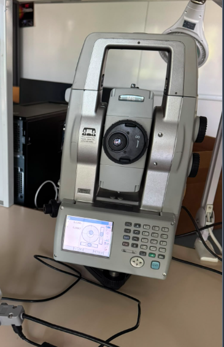
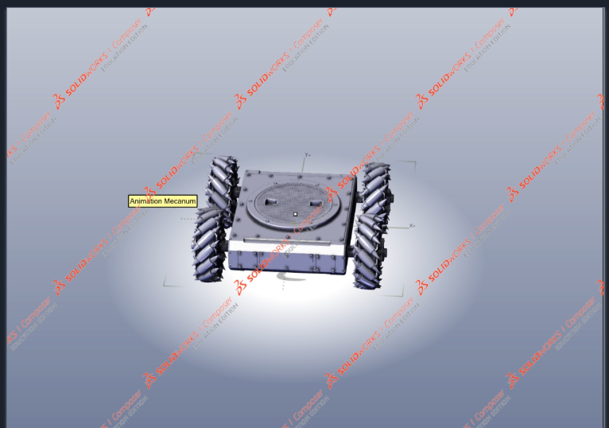

# TopoBot

  <strong>Autonomous holonomic robot for topographic surface flatness inspection</strong> 
  ENSIM × ESGT · 4th-year engineering project · 2025–2026

  

---

## Overview

**TopoBot** is a holonomic mobile robot designed to automate **surface flatness inspection** using a **robotic total station**.

In a conventional workflow, an operator manually moves a prism from point to point while another operator performs measurements with the total station.  
TopoBot replaces this repetitive process by autonomously moving over a configurable grid, deploying the prism at measurement points, and coordinating the acquisition workflow.

The project was developed by a **4-student engineering team** as part of the **ENSIM × ESGT** collaboration.

---

## Why this project matters

TopoBot was designed to:

- reduce manual effort during topographic inspection;
- improve repeatability of measurement campaigns;
- automate prism positioning over a measurement grid;
- provide a digital supervision interface for mission execution and monitoring;
- enable export of measurement data for post-processing.

---

## Key features

- **Holonomic mobile platform** with **Mecanum wheels**
- **STM32 F446RE** for real-time embedded control
- **Raspberry Pi** for high-level supervision
- **Custom KiCad control board**
- **XBee radio communication** with the robotic total station workflow
- **AX-12 servo** for prism deployment
- **Mission planning** over a configurable grid
- **Tablet-oriented supervision app**: *TopoBot Manager*
- **Real-time activity log** and measurement monitoring
- **CSV data export**
- **Prototype validated on physical robot**

---

## System at a glance

### Robot platform

  

### Total station used for measurements

  

### CAD overview

  

---

## Mission workflow

A typical TopoBot mission follows these steps:

1. Define the measurement area and grid resolution  
2. Initialize the robot and the measurement workflow  
3. Start the mission from the TopoBot Manager interface  
4. Navigate autonomously from point to point  
5. Deploy the prism at each measurement location  
6. Receive and log measurement feedback  
7. Display mission progress in real time  
8. Export the collected data  

---

# Hardware

Main hardware components:

- STM32 Nucleo F446RE  
- Raspberry Pi  
- Lynxmotion A4WD3 mobile chassis  
- 4 Mecanum wheels  
- 2 Sabertooth motor drivers  
- Incremental wheel encoders  
- AX-12 servomotor  
- XBee S2C radio modules  
- Robotic total station  
- Custom power/control board  
- Battery monitoring and emergency stop  

---

# Custom electronics

A dedicated board was designed in KiCad and manufactured for the project.

  

This board integrates:

- encoder interfaces  
- motor-driver connections  
- AX-12 interface  
- XBee communication interface  
- emergency-stop circuitry  
- battery monitoring  

---

# Embedded control

The STM32 firmware provides the real-time layer of the robot.

Main embedded functions:

- Mecanum wheel control  
- motion execution  
- encoder acquisition  
- odometry  
- PID-based control  
- robot state management  
- Raspberry Pi / STM32 communication  
- AX-12 prism deployment control  

The mission logic relies on a configurable measurement grid and a **boustrophedon-style trajectory**.

---

# Validation and results

The prototype was progressively validated on the physical robot.

Validation activities included:

- motor direction checks  
- wheel-level testing  
- Mecanum movement validation  
- encoder acquisition  
- odometry tests  
- Raspberry Pi / STM32 communication  
- XBee communication tests  
- AX-12 prism deployment  
- full mission integration testing  

### What was successfully validated

- basic robot movement  
- embedded control architecture  
- mission supervision workflow  
- prism deployment mechanism  
- communication chain between subsystems  

### Main improvement areas identified

- finer PID tuning  
- improved positioning accuracy  
- odometry / total-station data fusion  
- increased radio-link reliability  
- more robust autonomous mission execution  

---

# Budget

The project was developed under a **€500 budget**.

- Estimated total budget: **€500**  
- Actual project cost: **€318.26**  

A reuse-oriented approach was adopted to limit costs and improve sustainability.

---

# My contribution

Within the 4-student team, my work focused mainly on:

- developing and validating the robot’s movements  
- testing trajectory execution on the prototype  
- using encoder feedback to identify and reduce motion errors  
- contributing to the integration of the STM32, Raspberry Pi, motors and actuators  
- participating in mission-point and trajectory management  
- conducting functional tests on the robot  

---

# Repository structure

topobot/
+-- assets/
¦   +-- images/
¦   ¦   +-- hero/
¦   ¦   +-- hardware/
¦   ¦   +-- ui/
¦   ¦   +-- diagrams/
¦   +-- video/
¦
+-- docs/
¦   +-- presentation/
¦   +-- report/
¦   +-- technical/
¦
+-- firmware/
¦   +-- stm32/
¦
+-- hardware/
¦   +-- control-board/
¦       +-- kicad/
¦       +-- manufacturing/
¦           +-- gerbers/
¦
+-- software/
+-- raspberry-pi/
+-- topobot-manager/
+-- backend/
+-- frontend/

---

# Technologies

### Embedded systems  
C · STM32 F446RE · STM32CubeIDE · HAL  

### High-level software  
Python · Raspberry Pi  

### Robotics & control  
Mecanum kinematics · Encoders · Odometry · PID · AX-12  

### Communication  
UART · XBee  

### Electronics  
KiCad · PCB design · Gerber  

### Development & validation  
Git · GitHub · Hardware testing · Technical documentation  

---

# Demo

A short demonstration video is available in the repository:

- **[Watch the demo](assets/video/topobot-demo.mp4)**

Tip: for better GitHub presentation, you can also add a GIF preview in `assets/images/hero/`.

---

# Documentation

Detailed engineering documentation is available in `docs/`.

Main documents:

- **[Final project report](docs/report/Rapport_final.pdf)**  
- **[Project presentation](docs/presentation/TopoBot_Presentation.pdf)**  

---

# Future work

Possible next improvements include:

- better localization accuracy  
- improved closed-loop control tuning  
- tighter integration with the total station feedback  
- improved communication robustness  
- more autonomous and fault-tolerant mission execution  

---

# Authors

- Benewinde Kontiebo  
- Michael Essomba  
- Arsène Nguenang Youkap  
- Aymane Fariss  

**ENSIM × ESGT**  
Academic year: **2025–2026**
