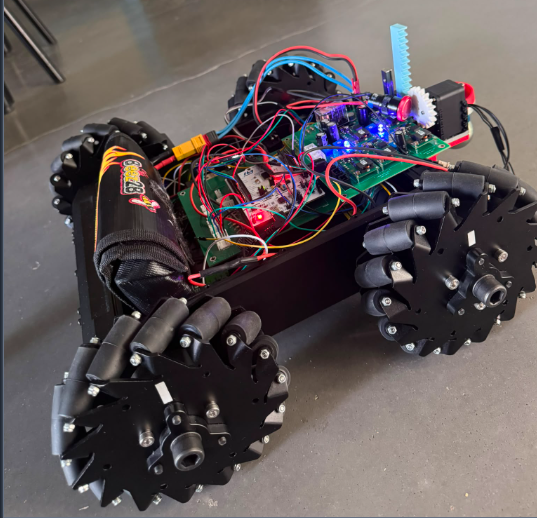
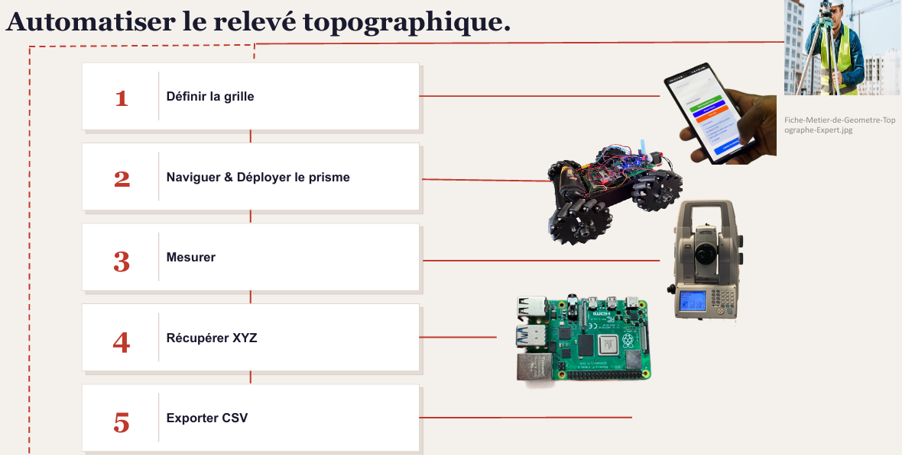
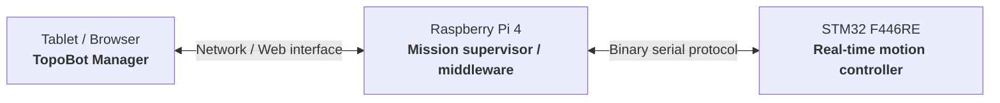
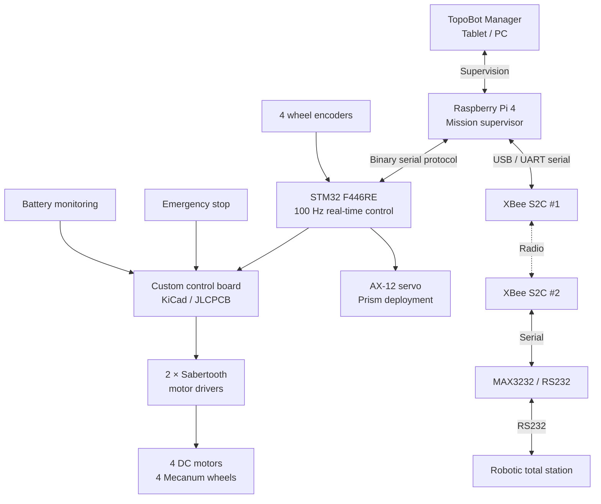
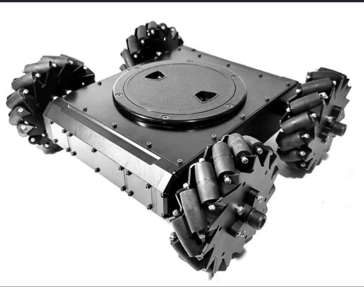
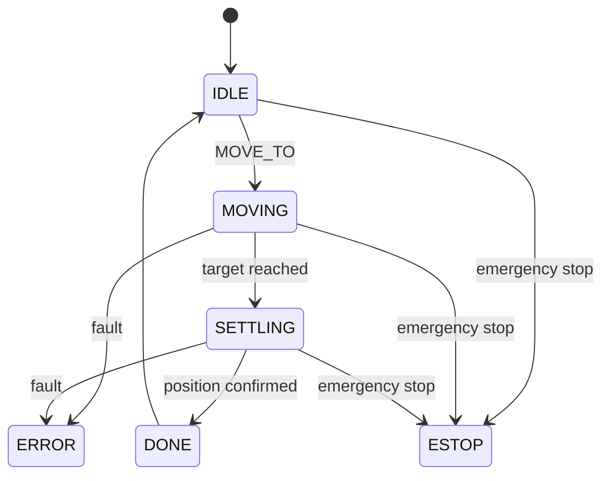
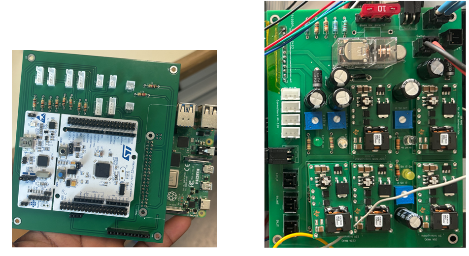
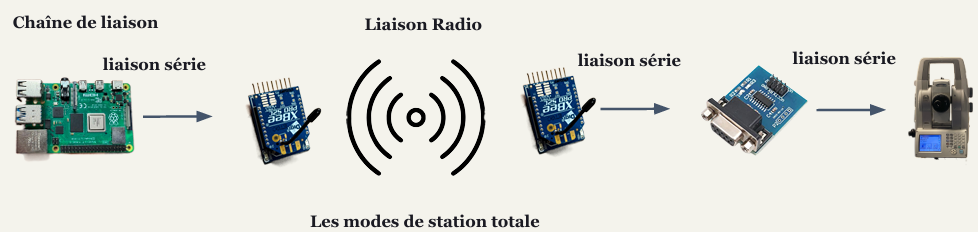
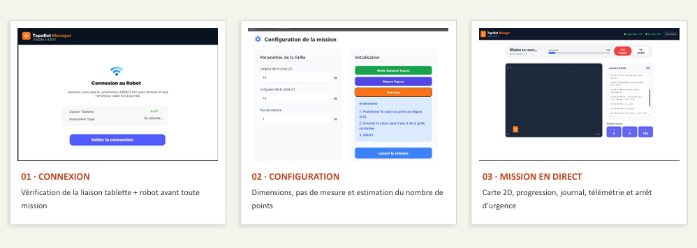
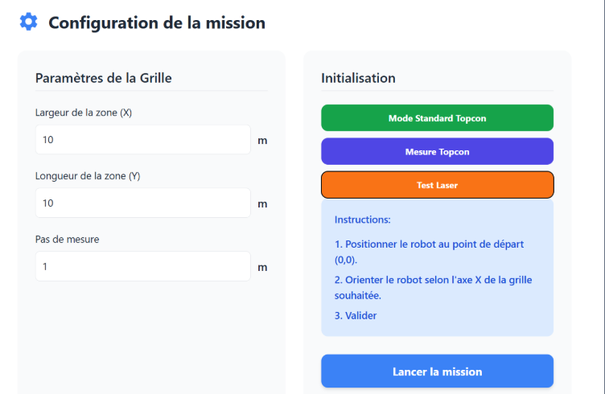

# TopoBot

<p align="center">
  <strong>Autonomous holonomic robot for automated topographic surface-flatness inspection</strong><br>
  ENSIM × ESGT · 4th-year Engineering Project · 2025–2026
</p>

<p align="center">
  
</p>

<p align="center">
  <strong>STM32 F446RE · Raspberry Pi · Mecanum · Encoders · AX-12 · XBee · KiCad · Python · C</strong>
</p>

---

## Project overview

**TopoBot** is a holonomic mobile robot developed to automate the repetitive part of a topographic surface-flatness survey.

In a conventional workflow, an operator manually moves a reflector from point to point while another operator operates the total station. TopoBot was designed to replace this manual point-by-point displacement with a configurable robotic mission:

1. define the measurement grid;
2. navigate to each waypoint;
3. deploy the topographic prism;
4. trigger / acquire the measurement;
5. recover the coordinates;
6. store and export the results.

The project combines **robotics, embedded control, electronics, radio communication, software supervision and topographic instrumentation** in one integrated prototype.

> **Project status:** the main hardware/software building blocks were integrated and validated on the prototype. Final industrial-grade accuracy, complete odometry/total-station fusion and a full production flatness campaign remain future work.

---

## Project at a glance

| Item | Implementation |
|---|---|
| Mobile base | Lynxmotion A4WD3 with 4 Mecanum wheels |
| Real-time controller | STM32 Nucleo F446RE |
| High-level computer | Raspberry Pi 4 |
| Motor power stage | 2 × Sabertooth motor drivers |
| Motion feedback | 4 incremental wheel encoders |
| Prism mechanism | AX-12 servomotor + rack-and-pinion mechanism |
| Station communication | XBee S2C radio link + serial / RS232 interface |
| Supervision | TopoBot Manager on tablet / browser |
| Data storage | SQLite on Raspberry Pi |
| Export | CSV |
| Real-time control loop | 100 Hz |
| Project budget | €500 |
| Actual project cost | €318.26 |
| Team | 4 engineering students |

### Design target

The functional specification targeted a configurable survey grid up to **50 m × 50 m**, with a nominal **0.5 m grid spacing** and a **40 mm spherical reflector**.

This is a **design requirement**, not a claim that the complete 50 × 50 m campaign was validated during the project.

---

# 1. Problem and mission

Manual surface inspection with a total station is repetitive: the reflector must be moved and positioned at many points, while measurements are triggered and recorded.

TopoBot aims to transform this workflow into a supervised autonomous sequence.

<p align="center">
  
</p>

## Nominal survey cycle

```text
Define grid
    ?
Generate waypoints
    ?
Navigate to waypoint
    ?
Stabilize robot
    ?
Deploy prism
    ?
Trigger total-station measurement
    ?
Recover XYZ / angles / distance
    ?
Retract prism
    ?
Store point in SQLite
    ?
Send progress to TopoBot Manager
    ?
Next waypoint
    ?
Export mission data to CSV
```

The trajectory is generated as a **boustrophedon path**: the direction alternates from one grid row to the next to reduce unnecessary travel.

---

# 2. Functional architecture

The robot must interact with the surveyor, the surface, the total station, the energy source and the safety environment.

<p align="center">
  
</p>

The main service functions are:

| Ref. | Function | Main requirement |
|---|---|---|
| FP1 | Move and orient the reflector | Configurable grid, 40 mm reflector |
| FC1 | Communicate with the total station | XBee S2C radio link, commands + coordinates |
| FC2 | Provide configuration and monitoring | Tablet / smartphone interface |
| FC3 | Provide energy autonomy | Rechargeable battery |
| FC4 | Operate in an indoor environment | Flat surface, future obstacle/drop detection |
| FC5 | Respect safety/environment constraints | Emergency stop and safe integration |

---

# 3. Robot structure

TopoBot is not a single-controller robot. It uses a **distributed architecture** in which the computational responsibilities are separated.

## Three control levels



### Level 1 — Tablet / front-end

The operator uses TopoBot Manager to:

- connect to the robot;
- configure the survey area;
- choose the grid spacing;
- initialize the measurement mode;
- launch the mission;
- monitor progress;
- read logs and telemetry;
- stop the robot;
- export results.

### Level 2 — Raspberry Pi / middleware

The Raspberry Pi acts as the high-level computer. It is responsible for:

- mission generation;
- waypoint sequencing;
- communication with the STM32;
- communication with the total station;
- measurement orchestration;
- SQLite data storage;
- WebSocket progress updates;
- CSV export;
- serving the supervision application.

### Level 3 — STM32 / real-time control

The STM32 F446RE performs the time-critical functions:

- encoder acquisition;
- odometry;
- motion state machine;
- closed-loop motor control;
- Sabertooth command generation;
- emergency-stop handling;
- AX-12 prism control;
- execution of high-level motion orders.

This separation keeps real-time control local to the microcontroller while the Raspberry Pi focuses on supervision and mission logic.

---

# 4. Complete hardware architecture



<p align="center">
  
</p>

---

# 5. Holonomic Mecanum platform

The Lynxmotion A4WD3 base uses four Mecanum wheels, allowing longitudinal, lateral and rotational motion.

## Wheel-direction combinations

| Motion | Front Left | Front Right | Rear Left | Rear Right |
|---|---:|---:|---:|---:|
| Forward | + | + | + | + |
| Backward | - | - | - | - |
| Left translation | - | + | + | - |
| Right translation | + | - | - | + |
| Left rotation | - | + | - | + |
| Right rotation | + | - | + | - |

The current survey mission mainly uses **translations with a constant orientation**. Nevertheless, the command interface preserves the full pose parameter:

```text
MOVE_TO(x, y, theta)
```

This keeps the architecture extensible toward complete pose control.

## Physical testing

Early tests demonstrated the expected Mecanum motion but also revealed parasitic rotation during straight translations due to wheel/motor asymmetry.

This led to:

- individual wheel testing;
- lower-speed validation;
- exploitation of encoder feedback;
- progressive closed-loop tuning.

---

# 6. STM32 real-time control

The embedded firmware is organised around several modules:

```text
STM32 firmware
+-- Mecanum kinematics
+-- Encoder acquisition
+-- Odometry
+-- PID / motion control
+-- Robot state machine
+-- Raspberry Pi protocol
+-- AX-12 prism control
+-- Safety / robot configuration
```

The repository contains the STM32 project in:

```text
firmware/stm32/
```

## Robot state machine

The controller uses the following main states:



Main states:

- `IDLE` — waiting for a command;
- `MOVING` — moving toward the target;
- `SETTLING` — stabilizing around the waypoint;
- `DONE` — waypoint reached and confirmed;
- `ERROR` / `ESTOP` — error or emergency stop.

The Raspberry Pi only sends the next waypoint after receiving a `DONE` status.

---

# 7. Raspberry Pi ? STM32 protocol

The Raspberry Pi does not directly control the motors.

It sends high-level commands to the STM32 using a lightweight binary protocol:

```text
[ START | CMD | LEN | PAYLOAD | CRC ]
```

The project uses a simple XOR-based CRC over the command, payload length and payload.

## Main commands

| Command | Role |
|---|---|
| `MOVE_TO` | Reach target pose `(x, y, ?)` |
| `STOP` | Immediate robot stop |
| `RESET_ODOM` | Reset odometry before a mission |
| `GET_STATUS` | Read position, speed and current state |
| `DEPLOY_PRISM` | Deploy the topographic prism |
| `RETRACT_PRISM` | Retract the prism |

The STM32 returns status frames such as:

```text
STATUS
DONE
ERROR
```

These messages allow the Raspberry Pi backend to orchestrate the mission without interfering with the real-time control loop.

---

# 8. Automatic mission logic

The mission is generated from:

```text
Zone width  = X
Zone length = Y
Grid step   = p
```

The backend generates the waypoint set:

```text
(xi, yj)
xi = i × p
yj = j × p
```

and orders them in a boustrophedon trajectory.

## Exact mission order

```text
1. RESET_ODOM
   +- Reset the robot local reference before starting.

2. Generate waypoints
   +- Build the complete boustrophedon measurement grid.

3. For each waypoint:
   +- Send MOVE_TO(x, y, ?)
   +- Wait for STM32 STATUS updates
   +- Continue only after DONE

4. If measurement mode is enabled:
   +- DEPLOY_PRISM
   +- Trigger / request Topcon measurement
   +- Recover measurement values
   +- RETRACT_PRISM

5. Save measurement
   +- Timestamp + local coordinates + station data ? SQLite

6. Notify front-end
   +- Mission progress and current data ? WebSocket

7. Continue with next waypoint

8. End mission
   +- Export the recorded dataset to CSV
```

<p align="center">
  
</p>

A **station-independent test mode** was also kept. In this mode the robot can execute the grid with simulated measurement values, making it possible to debug navigation without depending on the topographic instrument.

---

# 9. Prism deployment mechanism

The topographic reflector is mounted on a rack-and-pinion mechanism actuated by an **AX-12 servomotor**.

The mechanism is responsible for:

```text
RETRACTED
    ?
DEPLOY_PRISM
    ?
Prism positioned for measurement
    ?
Total-station acquisition
    ?
RETRACT_PRISM
    ?
Robot resumes navigation
```

This sequence is synchronized with waypoint validation so that measurements are not requested while the robot is still moving.

---

# 10. Custom electronics

A custom control board was designed in **KiCad**, manufactured by **JLCPCB**, assembled and integrated into the robot.

<p align="center">
  
</p>

The control electronics centralize:

- four encoder interfaces;
- STM32 connectivity;
- Sabertooth motor-control connections;
- AX-12 interface;
- emergency-stop circuitry;
- centralized power management;
- analog battery monitoring;
- expansion ports for future ultrasonic sensors.

The pre-existing power board was reused, while the **control board was redesigned specifically for this project**.

The KiCad project and Gerber manufacturing files are available under:

```text
hardware/control-board/
+-- kicad/
+-- manufacturing/
    +-- gerbers/
```

---

# 11. XBee radio link and total-station interface

TopoBot communicates with the robotic total station through a dedicated radio/serial chain.

<p align="center">
  
</p>

## Communication chain

```text
Raspberry Pi
    ¦
    ¦ USB / UART serial
    ?
XBee S2C #1
    ))) RADIO (((
XBee S2C #2
    ¦
    ¦ Serial
    ?
MAX3232 / RS232 converter
    ¦
    ¦ RS232
    ?
Robotic total station
```

## XBee configuration used during the project

| Parameter | Configuration |
|---|---|
| Baud rate | 9600 |
| Data bits | 8 |
| Parity | None |
| Stop bits | 1 |
| Flow control | None |
| Channel | `C` / `0x0C` |
| PAN ID | `B332` |

The modules were configured using **Digi XCTU**.

## Total-station operating modes

The project explored three main station modes:

### Standard (`std`)
High-precision fixed measurement using fine targeting.

### Tracking (`trk`)
Fast tracking / targeting of a moving reflector.

### Continuous tracking
Continuous acquisition of distances and horizontal/vertical angles.

The automated acquisition sequence uses the station together with the robot prism workflow to recover the current measured point and feed it back into the mission data.

> **Known limitation:** the XBee radio link showed intermittent reliability problems during field testing. Improving the radio layer is one of the main future-work items.

---

# 12. TopoBot Manager

**TopoBot Manager** is the supervision interface designed for tablet use.

Its purpose is to hide the complexity of the robot, STM32, Raspberry Pi and total station behind a guided workflow.

<p align="center">
  
</p>

The application follows three main user stages.

## 01 — Connection

Before a mission starts, the interface verifies that the robot and measurement system are reachable.

Typical checks include:

- robot / Raspberry Pi connectivity;
- total-station link state;
- initialization readiness.

The operator cannot proceed until the system is ready.

## 02 — Mission configuration

The operator defines:

- survey width `X`;
- survey length `Y`;
- measurement step `p`;
- measurement mode.

The backend uses these values to determine the grid and generate the mission waypoints.

<p align="center">
  
</p>

## 03 — Live mission supervision

During execution, the interface displays:

- mission progress;
- current point;
- 2D map of the grid;
- robot position;
- completed measurement points;
- activity/event log;
- latest measurement values;
- radio / system information;
- emergency-stop action.

<p align="center">
  
</p>

---

# 13. Software communication layers

The complete information flow can be summarized as:

```text
+--------------------------------------+
¦ Tablet / Browser                    ¦
¦ TopoBot Manager                     ¦
¦ - configuration                     ¦
¦ - live map                          ¦
¦ - progress                          ¦
¦ - logs                              ¦
¦ - emergency stop                    ¦
+--------------------------------------+
                    ¦ HTTP / WebSocket
                    ?
+--------------------------------------+
¦ Raspberry Pi                        ¦
¦ Middleware / Mission Supervisor     ¦
¦ - route generation                  ¦
¦ - waypoint orchestration            ¦
¦ - SQLite                            ¦
¦ - CSV export                        ¦
¦ - total-station communication       ¦
+--------------------------------------+
                ¦               ¦
        Binary serial           ¦ XBee / serial
                ¦               ¦
                ?               ?
+----------------------+   +---------------------+
¦ STM32 F446RE         ¦   ¦ Robotic total      ¦
¦ - odometry           ¦   ¦ station            ¦
¦ - encoders           ¦   ¦ - measurement      ¦
¦ - PID                ¦   ¦ - tracking         ¦
¦ - motors             ¦   ¦ - XYZ / angles     ¦
¦ - AX-12              ¦   +---------------------+
+----------------------+
```

---

# 14. Data acquisition and export

Each measurement point is stored locally on the Raspberry Pi.

The project uses **SQLite** for mission data and exposes the final dataset through **CSV export**.

## Recorded fields

| Field | Meaning |
|---|---|
| `ID` | Unique measurement-point identifier |
| `HEURE` | Acquisition timestamp |
| `X`, `Y` | Local planar coordinates |
| `HZ` | Horizontal station angle |
| `V` | Vertical station angle |
| `DIST` | Radial distance measured by the station |

The mission data lifecycle is:

```text
Connection
    ?
Geometry configuration
    ?
Survey supervision
    ?
SQLite storage
    ?
CSV export
```

The CSV format was chosen to keep the results directly usable in spreadsheets and topographic post-processing tools.

---

# 15. Validation

The project was developed using progressive integration and physical tests.

## Tests performed

- individual motor-direction tests;
- Mecanum wheel-combination tests;
- forward/backward translation;
- lateral translation;
- encoder acquisition;
- odometry;
- Raspberry Pi ? STM32 communication;
- high-level `MOVE_TO` commands;
- robot state-machine behavior;
- AX-12 prism deployment/retraction;
- XBee radio communication;
- total-station operating modes;
- TopoBot Manager connection/configuration/live monitoring;
- mission generation and waypoint sequencing;
- station-independent simulated-measurement mode.

## Current validation status

| Subsystem | Status |
|---|---|
| Mecanum basic motion | ? Validated |
| STM32 real-time architecture | ? Implemented |
| Encoder feedback / odometry | ? Integrated |
| Raspberry Pi ? STM32 protocol | ? Implemented |
| High-level waypoint mission logic | ? Implemented |
| AX-12 prism deployment | ? Integrated and validated |
| Custom control PCB | ? Designed, manufactured and assembled |
| TopoBot Manager | ? Functional |
| Total-station communication modes | ? Exercised |
| XBee field robustness | ?? Functional but unreliable in some tests |
| Closed-loop tuning | ?? Requires finer adjustment |
| Odometry + total-station fusion | ?? Future work |
| Complete production flatness campaign | ?? Still to be finalized |

The goal of this repository is to present the **real engineering state of the prototype**, including both validated subsystems and remaining technical limitations.

---

# 16. Engineering challenges encountered

## Wheel synchronization

The first physical tests revealed unwanted rotation during straight movement.

Probable causes included:

- different mechanical behavior between motors;
- left/right timing asymmetry;
- open-loop control limitations.

Encoder feedback and closed-loop control were introduced to improve trajectory stability.

## Odometry drift

Wheel odometry accumulates errors when the wheels slip or the ground is irregular.

A future version should fuse:

```text
Wheel odometry
      +
High-precision total-station coordinates
      ?
Corrected robot localization
```

## Radio robustness

The XBee solution proved useful for prototyping but showed intermittent signal losses.

A more robust professional radio solution would be preferable for field deployment.

## Wiring reliability

The prototype contains a significant amount of point-to-point wiring. A future revision should use:

- locking connectors;
- improved cable routing;
- additional functions integrated directly onto the PCB.

## Active safety

Obstacle/drop sensors were planned in the architecture but were not fully operational in the final prototype.

---

# 17. My contribution

This was a **four-person team project** with distinct technical work packages.

My contribution focused primarily on **control, kinematics and motion validation**, including:

- development and validation of robot movement behavior;
- Mecanum motion testing;
- trajectory-execution testing;
- analysis of encoder feedback and positioning errors;
- participation in odometry / motion-control integration;
- contribution to waypoint and mission-motion logic;
- integration and testing of the AX-12 prism mechanism;
- physical prototype testing and debugging.

The complete project also includes major contributions from the other team members in supervision/UI, XBee communication and electronics/PCB integration.

---

# 18. Team organization

| Team member | Main work package |
|---|---|
| Bénéwindé Kontiebo | Project management · Supervision · HMI |
| Aymane Fariss | Communication · XBee / total-station link |
| Arsène Nguenang Youkap | Electronics · PCB · hardware integration |
| **Michael Essomba** | **Control · kinematics · AX-12 prism mechanism** |

The project was managed using an agile-inspired workflow with regular synchronization and milestone reviews.

---

# 19. Budget and reuse strategy

The project operated under a **€500 budget**.

| Metric | Value |
|---|---:|
| Available budget | €500 |
| Actual project cost | **€318.26** |
| Remaining budget | €181.74 |
| Budget utilization | ~64% |

A significant part of the platform was reused from previous cohorts:

- Lynxmotion chassis;
- DC motors;
- Mecanum wheels;
- Sabertooth drivers;
- XBee modules;
- AX-12 servo;
- prism mechanism;
- existing power board.

New spending focused mainly on the Raspberry Pi, STM32 boards, control electronics, passive components and PCB manufacturing.

---

# 20. Repository structure

```text
topobot/
+-- README.md
+-- .gitignore
¦
+-- assets/
¦   +-- images/
¦   ¦   +-- hero/
¦   ¦   ¦   +-- topobot-hero.png
¦   ¦   ¦
¦   ¦   +-- diagrams/
¦   ¦   ¦   +-- functional-architecture.png
¦   ¦   ¦   +-- mission-workflow.png
¦   ¦   ¦   +-- xbee-communication-chain.png
¦   ¦   ¦
¦   ¦   +-- hardware/
¦   ¦   ¦   +-- robot-platform.png
¦   ¦   ¦   +-- control-and-power-board.png
¦   ¦   ¦   +-- total-station.png
¦   ¦   ¦   +-- robot-cad-render.png
¦   ¦   ¦
¦   ¦   +-- ui/
¦   ¦       +-- topobot-manager-flow.png
¦   ¦       +-- mission-config.png
¦   ¦       +-- mission-live-dashboard.png
¦   ¦
¦   +-- video/
¦       +-- topobot-demo.mp4
¦
+-- docs/
¦   +-- presentation/
¦   +-- report/
¦   +-- technical/
¦
+-- firmware/
¦   +-- stm32/
¦
+-- hardware/
¦   +-- control-board/
¦       +-- kicad/
¦       +-- manufacturing/
¦           +-- gerbers/
¦
+-- software/
    +-- raspberry-pi/
    ¦   +-- tests/
    ¦
    +-- topobot-manager/
        +-- backend/
        +-- frontend/
```

Generated build files, local databases, virtual environments, IDE temporary files and dependency directories are intentionally excluded from version control.

---

# 21. Technologies

### Embedded systems

`C` · `STM32 F446RE` · `STM32CubeIDE` · `HAL`

### Robotics and control

`Mecanum kinematics` · `Encoders` · `Odometry` · `PID` · `State machine` · `AX-12`

### High-level software

`Python` · `Raspberry Pi` · `SQLite` · `WebSocket`

### Communication

`UART` · `Serial` · `XBee S2C` · `RS232`

### Electronics

`KiCad` · `PCB design` · `Gerber` · `JLCPCB`

### Instrumentation

`Robotic total station` · `Topographic prism` · `Tracking`

### Development

`Git` · `GitHub` · `Hardware testing` · `Technical documentation`

---

# 22. Demo

A short demonstration of the physical prototype is available here:

### [? Watch the TopoBot demo](assets/video/topobot-demo.mp4)

---

# 23. Documentation

Detailed engineering documentation is available in [`docs/`](docs/).

Main documents:

- [Final project report](docs/report/Rapport_final.pdf)
- [Project presentation](docs/presentation/TopoBot_Presentation.pdf)
- [STM32 firmware documentation](docs/technical/firmware/)
- [Hardware and wiring documentation](docs/technical/hardware/)
- [Raspberry Pi documentation](docs/technical/raspberry-pi/)
- [Testing documentation](docs/technical/tests/)
- [Odometry, PID and validation documentation](docs/technical/advanced/)

---

# 24. Future work

The next engineering priorities are:

1. **PID tuning**  
   Reduce oscillations and trajectory error.

2. **Odometry calibration**  
   Improve the estimation of `x`, `y` and `?`.

3. **Odometry / total-station sensor fusion**  
   Correct wheel-slip drift using high-precision station feedback.

4. **Radio reliability**  
   Replace or harden the XBee communication chain for field use.

5. **Active navigation safety**  
   Integrate obstacle, drop and stair detection.

6. **Wiring redesign**  
   Reduce point-to-point wiring and use locking connectors.

7. **Large-grid validation**  
   Validate longer missions and repeated surveys under realistic conditions.

8. **Full flatness campaign**  
   Complete the end-to-end autonomous survey and compare results against a reference workflow.

---

# 25. Project outcome

TopoBot evolved from an inherited mechanical platform into an integrated robotic prototype combining:

- a redesigned embedded architecture;
- STM32 real-time motion control;
- Raspberry Pi mission supervision;
- custom control electronics;
- Mecanum mobility;
- encoder odometry;
- AX-12 prism deployment;
- XBee / total-station communication;
- tablet-based mission supervision;
- local measurement storage and CSV export.

The project demonstrates the feasibility of automating a topographic surface-inspection workflow while also identifying the engineering work still required to reach robust field deployment.

---

# Project team

**ENSIM × ESGT — Le Mans University**  
Academic year: **2025–2026**

- Bénéwindé Kontiebo
- **Michael Essomba**
- Arsène Nguenang Youkap
- Aymane Fariss
