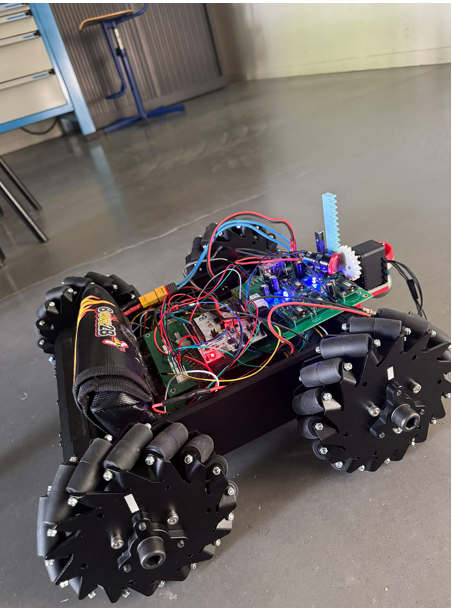
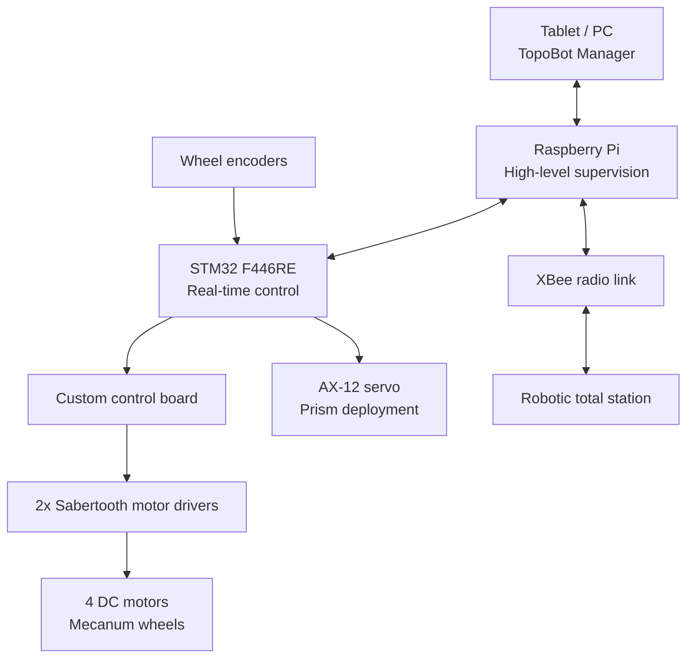
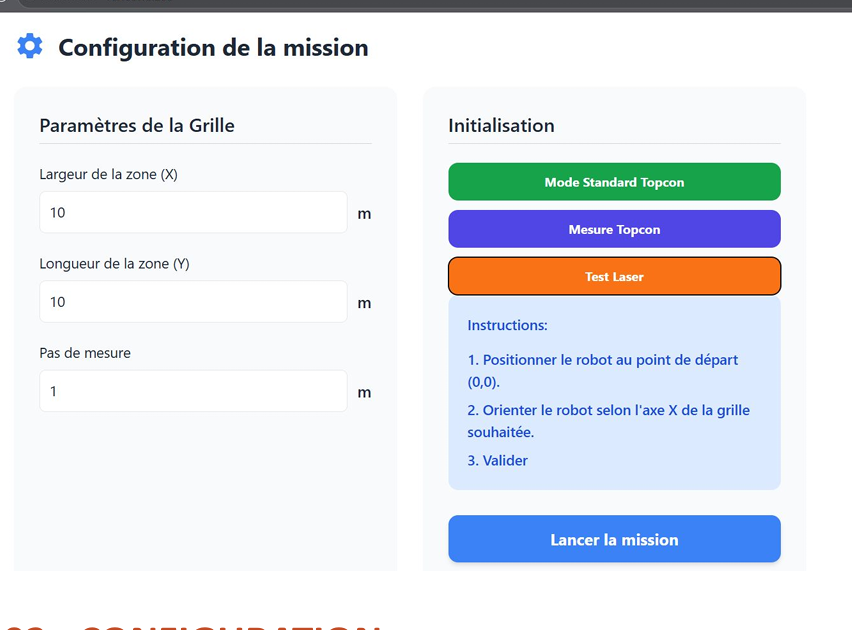

# TopoBot

<p align="center">
  <strong>Holonomic mobile robot for automated topographic surface measurements</strong><br>
  ENSIM × ESGT · Engineering Project · 2025–2026
</p>

<p align="center">
  
</p>

## Overview

**TopoBot** is a holonomic mobile robot developed to automate surface flatness measurements using a robotic total station.

In a conventional workflow, an operator manually moves a reflector from point to point while another operator controls the total station. TopoBot was designed to automate this process by moving the reflector across a configurable measurement grid, coordinating robot motion with topographic measurements and exporting the acquired data.

The project was developed by a **4-student engineering team** as part of the ENSIM × ESGT collaboration.

---

## System architecture

TopoBot uses a distributed embedded architecture separating high-level supervision from real-time control.



### Main hardware

- STM32 Nucleo F446RE
- Raspberry Pi
- Lynxmotion A4WD3 mobile base
- 4 Mecanum wheels
- 2 Sabertooth motor drivers
- Incremental wheel encoders
- AX-12 servomotor
- XBee S2C radio modules
- Robotic total station
- Custom KiCad control board
- Emergency-stop and battery-monitoring circuitry

---

## Embedded control

The STM32 firmware provides the real-time control layer of the robot.

The firmware is organised into several modules:

- Mecanum wheel control
- odometry
- PID control
- robot state and motion control
- Raspberry Pi / STM32 communication protocol
- AX-12 servomotor control
- encoder acquisition

A lightweight binary protocol is used between the Raspberry Pi and the STM32 to coordinate high-level missions with the embedded controller.

The mission logic is based on a configurable grid and a boustrophedon-style trajectory.

---

## Electronics

A dedicated control board was designed in **KiCad** and manufactured for the project.

<p align="center">
  
</p>

The board integrates the main interfaces required by the robot, including:

- encoder signals
- motor-control connections
- AX-12 servomotor interface
- XBee communication
- emergency-stop circuitry
- battery monitoring

The repository contains both the **KiCad design sources** and the **Gerber manufacturing files**.

---

## TopoBot Manager

TopoBot is supervised through **TopoBot Manager**, a tablet-oriented interface connected to the Raspberry Pi.

<p align="center">
  
</p>

The application provides:

- robot connection checking
- mission configuration
- measurement-grid configuration
- live mission monitoring
- 2D trajectory visualisation
- telemetry and event logging
- emergency-stop control
- measurement-data export

Measurement points can be stored locally and exported as CSV files for further processing.

---

## Testing and validation

The project was validated progressively on the physical prototype.

Tests included:

- individual motor and wheel-direction checks
- Mecanum movement validation
- encoder acquisition
- odometry tests
- Raspberry Pi / STM32 communication
- XBee communication
- AX-12 prism deployment
- trajectory execution
- integration tests on the complete robot

The tests validated the basic motion capabilities, the command architecture and the prism-deployment mechanism.

### Identified improvements

The project also highlighted several areas for future development:

- finer PID tuning
- improved trajectory accuracy
- odometry / total-station data fusion
- increased radio-link reliability
- improved autonomous navigation robustness

---

## My contribution

Within the four-person project team, my work focused mainly on:

- developing and validating robot movements;
- using encoder feedback to analyse and reduce positioning errors;
- testing Mecanum-wheel motion and trajectory execution;
- participating in the integration of the STM32, Raspberry Pi, motors and actuators;
- contributing to mission point and trajectory management;
- carrying out functional tests on the physical prototype.

---

## Demo

A short video of the robot operating on the prototype is available here:

### [? Watch the TopoBot demo](assets/video/topobot-demo.mp4)

---

## Repository structure

```text
topobot/
¦
+-- assets/
¦   +-- images/
¦   +-- video/
¦
+-- docs/
¦   +-- presentation/
¦   +-- report/
¦   +-- technical/
¦
+-- firmware/
¦   +-- stm32/
¦
+-- hardware/
¦   +-- control-board/
¦       +-- Kicad/
¦       +-- manufacturing/
¦           +-- gerbers/
¦
+-- software/
    +-- raspberry-pi/
    ¦   +-- tests/
    ¦
    +-- topobot-manager/
        +-- backend/
        +-- frontend/
```

Generated build files, virtual environments, local databases and temporary files are intentionally excluded from version control.

---

## Technologies

**Embedded systems**

`C` · `STM32 F446RE` · `STM32CubeIDE` · `HAL`

**High-level software**

`Python` · `Raspberry Pi`

**Robotics & control**

`Mecanum kinematics` · `Encoders` · `Odometry` · `PID` · `AX-12`

**Communication**

`UART` · `XBee`

**Electronics**

`KiCad` · `PCB design` · `Gerber`

**Development & validation**

`Git` · `GitHub` · `Hardware testing` · `Technical documentation`

---

## Documentation

Detailed engineering documentation is available in [`docs/`](docs/).

Main documents:

- [Final project report](docs/report/Rapport_final.pdf)
- [Project presentation](docs/presentation/TopoBot_Presentation.pdf)
- [STM32 firmware documentation](docs/technical/firmware/)
- [Hardware and wiring documentation](docs/technical/hardware/)
- [Raspberry Pi documentation](docs/technical/raspberry-pi/)
- [Testing documentation](docs/technical/tests/)
- [Odometry, PID and validation documents](docs/technical/advanced/)

---

## Project team

Engineering project — **ENSIM × ESGT**

- Benewinde Kontiebo
- Michael ESSOMBA
- Arsène NGUENANG YOUKAP
- Aymane Fariss

Academic year: **2025–2026**

---

## Project status

The project reached an integrated prototype stage with:

- functional holonomic motion;
- embedded real-time control;
- custom control electronics;
- AX-12 prism deployment;
- radio communication with the measurement system;
- a functional tablet supervision interface.

Further work would focus mainly on control-loop tuning, localisation accuracy and robustness of the complete autonomous measurement workflow.